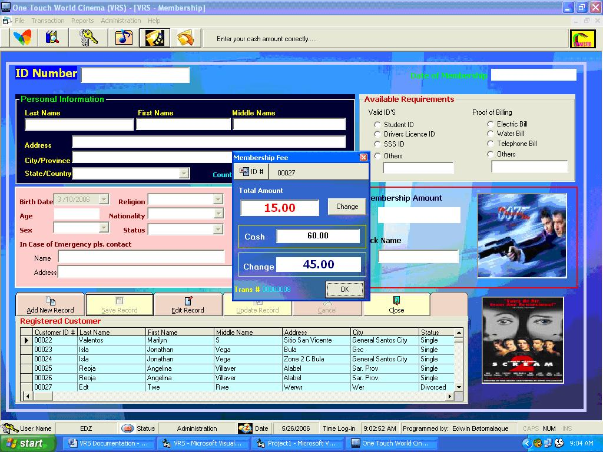



## Video Rental System\(VRS\)

### Description

This code is intended for the video store using video rental system. The system can automate the process of renting tapes and receiving returned tapes, including calculating and printing patron bills, which may or may not be done at the same time the tape is returned.
 
### More Info
 

             |
---                |---
**Submitted On**   |2006-07-01 18:40:10
**By**             |[Edwin H\. Batomalaque](https://github.com/Planet-Source-Code/PSCIndex/blob/master/ByAuthor/edwin-h-batomalaque.md)
**Level**          |Intermediate
**User Rating**    |4.6 (23 globes from 5 users)
**Compatibility**  |VB 4\.0 \(16\-bit\), VB 4\.0 \(32\-bit\), VB 5\.0, VB 6\.0, VBA MS Access
**Category**       |[Microsoft Office Apps/VBA](https://github.com/Planet-Source-Code/PSCIndex/blob/master/ByCategory/microsoft-office-apps-vba__1-42.md)
**World**          |[Visual Basic](https://github.com/Planet-Source-Code/PSCIndex/blob/master/ByWorld/visual-basic.md)
**Archive File**   |[Video\_Rent200383722006\.zip](https://github.com/Planet-Source-Code/edwin-h-batomalaque-video-rental-system-vrs__1-65843/archive/master.zip)

